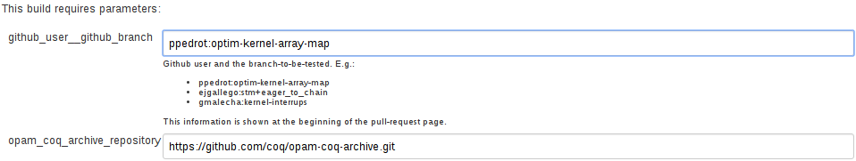
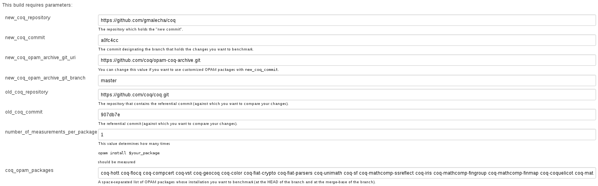
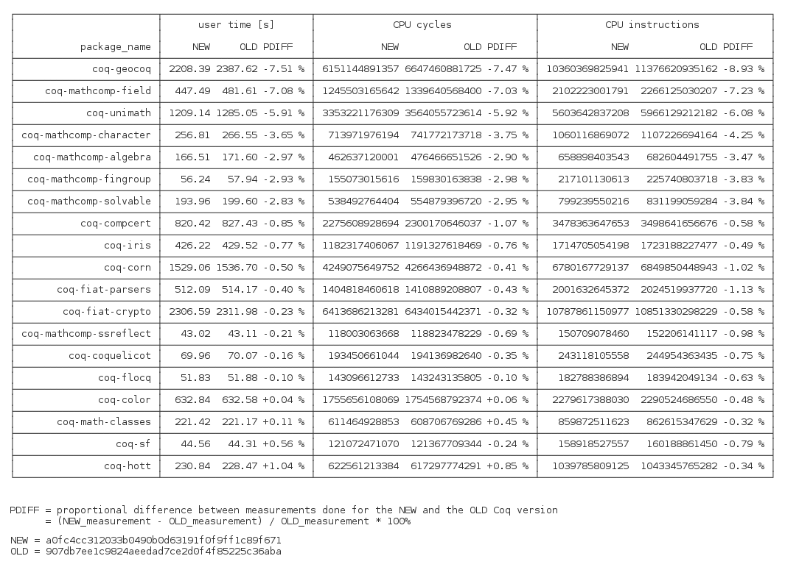

I don't have a Jenkins account
------------------------------

If you do not yet have an account at our Jenkins instance, you can create one:

-   go to [this place](https://ci.inria.fr/)
-   click on "Sign Up"
-   provide required information
-   click on "Log In"

Then:

-   go to ["dashboard"](https://ci.inria.fr/dashboard)
-   click on "Join an existing project"
-   and request to join the project "coq"

You'll have to wait until some of the existing members of the project actually confirms your membership.
You need to be an admin to start builds.

I have a Jenkins account
------------------------

The following sections describe how you can use your Jenkins account

-   either to test whether your branch does not break some of the tracked developments
-   or to run benchmarks (i.e. observe changes in compilation times of tracked developments).

Check if a given branch breaks some of the tracked developments
---------------------------------------------------------------

E.g. in case of [this pull request](https://github.com/coq/coq/pull/434) it means we have to "build" the [opam-install](https://ci.inria.fr/coq/view/opam/job/opam-install) job with the following parameters:



Benchmarking (without "overlays")
---------------------------------

E.g. in case of [this pull request](https://github.com/coq/coq/pull/155) it means we have to "build" the [benchmark-part-of-the-branch](https://ci.inria.fr/coq/view/opam/job/benchmark-part-of-the-branch) job with the following parameters:



where the field `coq_opam_packages` is by default set to:

```
coq-hott coq-flocq coq-compcert coq-vst coq-geocoq coq-color coq-fiat-crypto coq-fiat-parsers coq-unimath coq-sf coq-mathcomp-ssreflect coq-iris coq-mathcomp-fingroup coq-mathcomp-finmap coq-coquelicot coq-mathcomp-algebra coq-mathcomp-solvable coq-mathcomp-field coq-mathcomp-character coq-mathcomp-odd_order
```

Assuming that you will use the above value for the `coq_opam_packages` field, the benchmarking will finish in:

-   7 hours when each package is compiled once
-   15 hours when each package is compiled twice
-   22 hours when each package is compiled thrice
-   28 hours when each package is compiled four-times

------------------------------------------------------------------------

The job itself produces a looooong log. At its end you should see the results rendered as a table:



Each line shows the measurement for a single OPAM package.

Each measured/computed quantity has its own column.

The git commits, that were considered are stated explicitely below the table as **NEW** and **OLD**.

E.g., in the table shown above, we see that the compilation of **coq-geocoq**

-   originally took 2394.71 seconds
-   now it takes 2215.65
-   which means that it decreased by cca. 7%

The lines of the table are ordered wrt. improvements in the overall compilation times.

Benchmarking (with "overlays")
------------------------------

The following two parameters of the [job](https://ci.inria.fr/coq/view/benchmarking/job/benchmark-part-of-the-branch/):

-   `new_coq_opam_archive_git_uri`
-   `new_coq_opam_archive_git_branch`

enable us to define "overlays", i.e. tweak the definitions of OPAM packages to be used with `new_coq_commit`.

Concretely, one has to:

-   clone the [official repository](https://github.com/coq/opam-coq-archive.git) that defines the OPAM packages
-   modify the definitions of the relevant OPAM packages as needed
-   push these modifications to some repository visible to Jenkins (e.g. to a personal github fork)
-   and when starting the [benchmarking job](https://ci.inria.fr/coq/view/benchmarking/job/benchmark-part-of-the-branch/), set the `new_coq_opam_archive_git_uri` and `new_coq_opam_archive_git_branch` appropriatelly.

